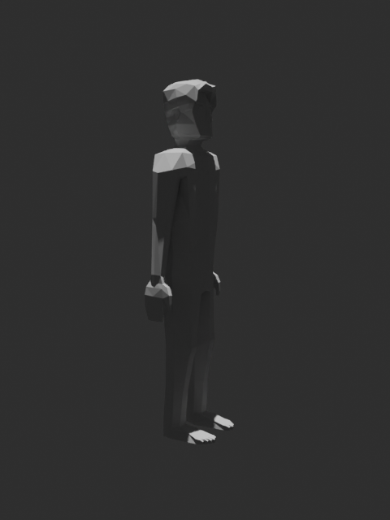
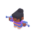

# Character Base Library — Generated Catalog

This catalog is generated from the exact GLBs stored beside each preview.
Choose a base by screenshot first; its measurement JSON and SVG templates then become the dimensional authority.

## Quaternius Human — rigged

- ID: `quaternius-human-rigged`
- License: CC0-1.0
- Stored model: `assets/character_bases/quaternius-human-rigged/model.glb`
- Default semantic envelope: 1.864 m front width/arm span × 1.750 m H × 0.332 m visual depth
- Orientation: Y-up · front horizontal axis=Z · depth axis=X
- Rig joints: 41 · animations: 8 · triangles: 1578
- Exact measurements: `assets/character_bases/quaternius-human-rigged/measurements.json`
- Visual templates: `assets/character_bases/quaternius-human-rigged/measurement_front.svg`, `assets/character_bases/quaternius-human-rigged/measurement_side.svg`

## Kenney Mini Character Male A

- ID: `kenney-mini-male-a`
- License: CC0-1.0
- Stored model: `assets/character_bases/kenney-mini-male-a/model.glb`
- Default semantic envelope: 2.000 m front width/arm span × 1.750 m H × 0.886 m visual depth
- Orientation: Y-up · front horizontal axis=X · depth axis=Z
- Rig joints: 7 · animations: 32 · triangles: 723
- Exact measurements: `assets/character_bases/kenney-mini-male-a/measurements.json`
- Visual templates: `assets/character_bases/kenney-mini-male-a/measurement_front.svg`, `assets/character_bases/kenney-mini-male-a/measurement_side.svg`

## Kenney Mini Character Male B

- ID: `kenney-mini-male-b`
- License: CC0-1.0
- Stored model: `assets/character_bases/kenney-mini-male-b/model.glb`
- Default semantic envelope: 2.030 m front width/arm span × 1.750 m H × 1.031 m visual depth
- Orientation: Y-up · front horizontal axis=X · depth axis=Z
- Rig joints: 7 · animations: 32 · triangles: 690
- Exact measurements: `assets/character_bases/kenney-mini-male-b/measurements.json`
- Visual templates: `assets/character_bases/kenney-mini-male-b/measurement_front.svg`, `assets/character_bases/kenney-mini-male-b/measurement_side.svg`

## Kenney Mini Character Male C

- ID: `kenney-mini-male-c`
- License: CC0-1.0
- Stored model: `assets/character_bases/kenney-mini-male-c/model.glb`
- Default semantic envelope: 1.693 m front width/arm span × 1.750 m H × 1.017 m visual depth
- Orientation: Y-up · front horizontal axis=X · depth axis=Z
- Rig joints: 7 · animations: 32 · triangles: 793
- Exact measurements: `assets/character_bases/kenney-mini-male-c/measurements.json`
- Visual templates: `assets/character_bases/kenney-mini-male-c/measurement_front.svg`, `assets/character_bases/kenney-mini-male-c/measurement_side.svg`

## Kenney Mini Character Male D

- ID: `kenney-mini-male-d`
- License: CC0-1.0
- Stored model: `assets/character_bases/kenney-mini-male-d/model.glb`
- Default semantic envelope: 1.860 m front width/arm span × 1.750 m H × 0.824 m visual depth
- Orientation: Y-up · front horizontal axis=X · depth axis=Z
- Rig joints: 7 · animations: 32 · triangles: 711
- Exact measurements: `assets/character_bases/kenney-mini-male-d/measurements.json`
- Visual templates: `assets/character_bases/kenney-mini-male-d/measurement_front.svg`, `assets/character_bases/kenney-mini-male-d/measurement_side.svg`

## Kenney Mini Character Male E

- ID: `kenney-mini-male-e`
- License: CC0-1.0
- Stored model: `assets/character_bases/kenney-mini-male-e/model.glb`
- Default semantic envelope: 1.986 m front width/arm span × 1.750 m H × 0.885 m visual depth
- Orientation: Y-up · front horizontal axis=X · depth axis=Z
- Rig joints: 7 · animations: 32 · triangles: 710
- Exact measurements: `assets/character_bases/kenney-mini-male-e/measurements.json`
- Visual templates: `assets/character_bases/kenney-mini-male-e/measurement_front.svg`, `assets/character_bases/kenney-mini-male-e/measurement_side.svg`

## Kenney Mini Character Male F

- ID: `kenney-mini-male-f`
- License: CC0-1.0
- Stored model: `assets/character_bases/kenney-mini-male-f/model.glb`
- Default semantic envelope: 2.000 m front width/arm span × 1.750 m H × 0.886 m visual depth
- Orientation: Y-up · front horizontal axis=X · depth axis=Z
- Rig joints: 7 · animations: 32 · triangles: 701
- Exact measurements: `assets/character_bases/kenney-mini-male-f/measurements.json`
- Visual templates: `assets/character_bases/kenney-mini-male-f/measurement_front.svg`, `assets/character_bases/kenney-mini-male-f/measurement_side.svg`

## Kenney Mini Character Female A

- ID: `kenney-mini-female-a`
- License: CC0-1.0
- Stored model: `assets/character_bases/kenney-mini-female-a/model.glb`
- Default semantic envelope: 2.479 m front width/arm span × 1.750 m H × 1.127 m visual depth
- Orientation: Y-up · front horizontal axis=X · depth axis=Z
- Rig joints: 7 · animations: 32 · triangles: 876
- Exact measurements: `assets/character_bases/kenney-mini-female-a/measurements.json`
- Visual templates: `assets/character_bases/kenney-mini-female-a/measurement_front.svg`, `assets/character_bases/kenney-mini-female-a/measurement_side.svg`

## Kenney Mini Character Female B

- ID: `kenney-mini-female-b`
- License: CC0-1.0
- Stored model: `assets/character_bases/kenney-mini-female-b/model.glb`
- Default semantic envelope: 1.856 m front width/arm span × 1.750 m H × 1.013 m visual depth
- Orientation: Y-up · front horizontal axis=X · depth axis=Z
- Rig joints: 7 · animations: 32 · triangles: 742
- Exact measurements: `assets/character_bases/kenney-mini-female-b/measurements.json`
- Visual templates: `assets/character_bases/kenney-mini-female-b/measurement_front.svg`, `assets/character_bases/kenney-mini-female-b/measurement_side.svg`

## Kenney Mini Character Female C

- ID: `kenney-mini-female-c`
- License: CC0-1.0
- Stored model: `assets/character_bases/kenney-mini-female-c/model.glb`
- Default semantic envelope: 1.731 m front width/arm span × 1.750 m H × 1.127 m visual depth
- Orientation: Y-up · front horizontal axis=X · depth axis=Z
- Rig joints: 7 · animations: 32 · triangles: 732
- Exact measurements: `assets/character_bases/kenney-mini-female-c/measurements.json`
- Visual templates: `assets/character_bases/kenney-mini-female-c/measurement_front.svg`, `assets/character_bases/kenney-mini-female-c/measurement_side.svg`

## Kenney Mini Character Female D

- ID: `kenney-mini-female-d`
- License: CC0-1.0
- Stored model: `assets/character_bases/kenney-mini-female-d/model.glb`
- Default semantic envelope: 1.731 m front width/arm span × 1.750 m H × 1.127 m visual depth
- Orientation: Y-up · front horizontal axis=X · depth axis=Z
- Rig joints: 7 · animations: 32 · triangles: 797
- Exact measurements: `assets/character_bases/kenney-mini-female-d/measurements.json`
- Visual templates: `assets/character_bases/kenney-mini-female-d/measurement_front.svg`, `assets/character_bases/kenney-mini-female-d/measurement_side.svg`

## Kenney Mini Character Female E

- ID: `kenney-mini-female-e`
- License: CC0-1.0
- Stored model: `assets/character_bases/kenney-mini-female-e/model.glb`
- Default semantic envelope: 1.874 m front width/arm span × 1.750 m H × 1.287 m visual depth
- Orientation: Y-up · front horizontal axis=X · depth axis=Z
- Rig joints: 7 · animations: 32 · triangles: 756
- Exact measurements: `assets/character_bases/kenney-mini-female-e/measurements.json`
- Visual templates: `assets/character_bases/kenney-mini-female-e/measurement_front.svg`, `assets/character_bases/kenney-mini-female-e/measurement_side.svg`

## Kenney Mini Character Female F

- ID: `kenney-mini-female-f`
- License: CC0-1.0
- Stored model: `assets/character_bases/kenney-mini-female-f/model.glb`
- Default semantic envelope: 2.000 m front width/arm span × 1.750 m H × 1.150 m visual depth
- Orientation: Y-up · front horizontal axis=X · depth axis=Z
- Rig joints: 7 · animations: 32 · triangles: 788
- Exact measurements: `assets/character_bases/kenney-mini-female-f/measurements.json`
- Visual templates: `assets/character_bases/kenney-mini-female-f/measurement_front.svg`, `assets/character_bases/kenney-mini-female-f/measurement_side.svg`
